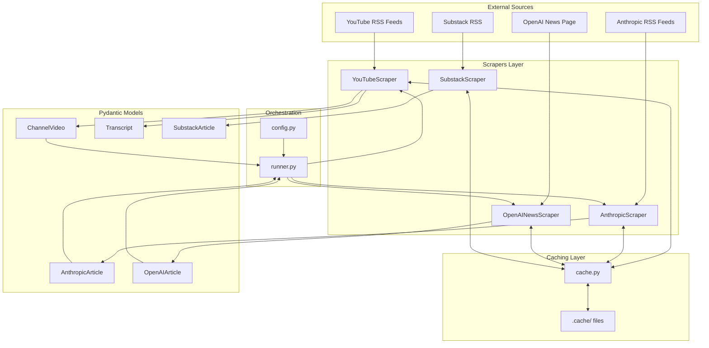
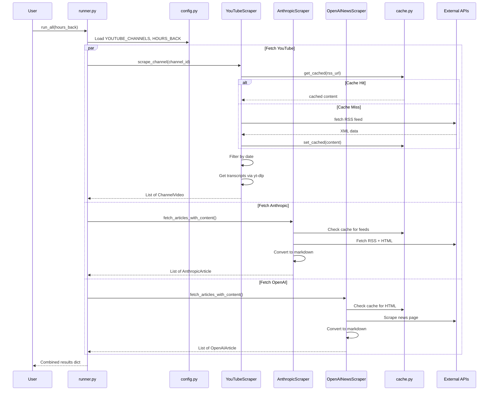

# Project Structure

## Directory Tree

```
ai-news-aggregator-test/
├── app/
│   └── ingest/
│       ├── config.py              # Configuration (HOURS_BACK, YOUTUBE_CHANNELS)
│       ├── runner.py              # Main orchestrator - runs all scrapers
│       └── scrapers/
│           ├── cache.py           # Caching utility for HTTP responses
│           ├── youtube.py         # YouTubeScraper (RSS + yt-dlp transcripts)
│           ├── anthropic_news.py  # AnthropicScraper (3 RSS feeds + markdown)
│           ├── openai_news.py     # OpenAINewsScraper (HTML scraping + markdown)
│           └── substack.py        # SubstackScraper (RSS feeds)
├── .cache/                        # Cached HTTP responses (auto-generated)
├── main.py                        # Application entry point
├── pyproject.toml                 # Dependencies (uv)
├── README.md                      # Project overview
└── YOUTUBE_USAGE.md               # YouTube scraper documentation
```

## Architecture Diagram



## Data Flow



## Component Details

### Scrapers

| Scraper | Source Type | Output Model | Content |
|---------|-------------|--------------|---------|
| `YouTubeScraper` | RSS + yt-dlp | `ChannelVideo`, `Transcript` | Video metadata + full transcript |
| `AnthropicScraper` | 3 RSS feeds | `AnthropicArticle` | News, Engineering, Research articles + markdown |
| `OpenAINewsScraper` | HTML scraping | `OpenAIArticle` | Blog articles + markdown content |
| `SubstackScraper` | RSS feed | `SubstackArticle` | Newsletter articles |

### Configuration (`config.py`)

```python
HOURS_BACK = 300        # How far back to look for content
YOUTUBE_CHANNELS = [    # List of channel IDs to monitor
    "UC11aHtNnc5bEPLI4jf6mnYg",
]
```

### Caching System

- Location: `.cache/` directory
- Format: MD5 hash of URL as filename
- Suffixes: `.xml` (RSS), `.html` (web pages), `.vtt` (transcripts)
- Control: `USE_CACHE` environment variable (default: enabled)

## Usage

```bash
# Run the full ingestion pipeline
python -m app.ingest.runner

# Or run directly
python app/ingest/runner.py
```

## Future Components (Planned)

```
app/
├── agent/                 # LLM summarization layer
│   └── system_prompt.py   # User persona/insights prompt
├── db/                    # Database layer
│   ├── models.py          # SQLAlchemy models (Source, Article)
│   └── session.py         # Database connection
├── digest/                # Daily digest generation
│   └── email.py           # HTML email formatting + SMTP
docker/
└── docker-compose.yml     # PostgreSQL container setup
```
