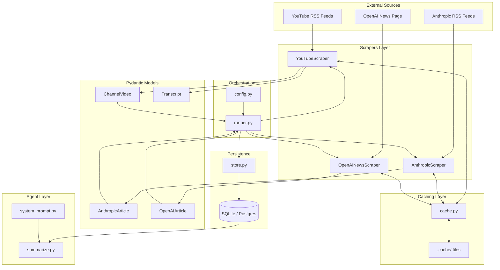
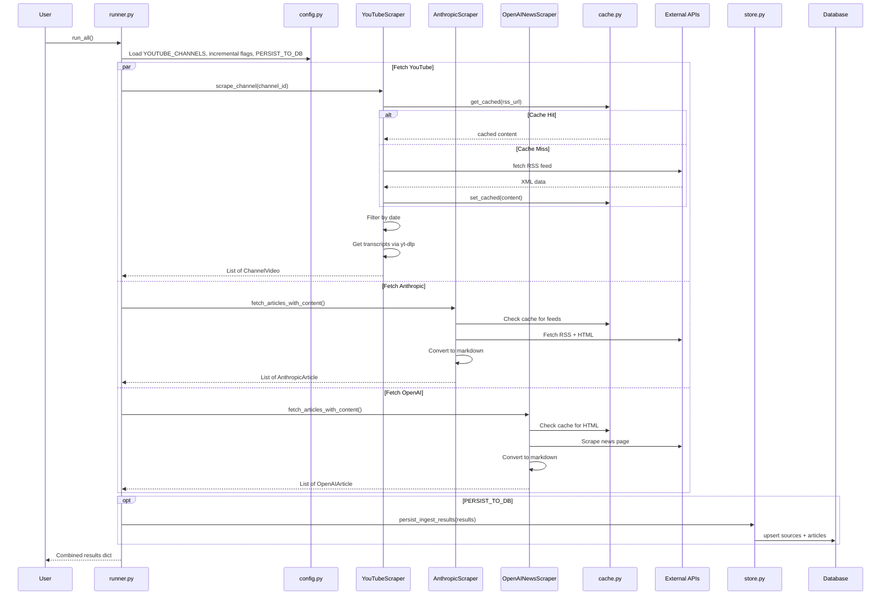

# Project Structure

## Directory Tree

```
ai-news-aggregator-test/
├── app/
│   ├── agent/
│   │   ├── config.py          # AGENT_LLM_BACKEND, Ollama/OpenAI model names
│   │   ├── llm_client.py      # OpenAI SDK → cloud or Ollama (/v1 compatible)
│   │   ├── system_prompt.py   # DEFAULT_SYSTEM_PROMPT (reader persona)
│   │   ├── summarize.py       # LLM summaries → Article.summary
│   │   └── __init__.py
│   ├── daily/
│   │   └── __main__.py        # Incremental ingest → no-updates email OR agent + digest send
│   ├── digest/
│   │   ├── config.py          # DIGEST_SMTP_*, DIGEST_EMAIL_*, DIGEST_MAX_ARTICLES
│   │   ├── build.py           # Load rows with summary → HTML + plain text
│   │   ├── no_updates.py      # Minimal email when ingest returns no new items
│   │   ├── mailer.py          # smtplib send
│   │   └── __init__.py
│   ├── db/
│   │   ├── models.py          # SQLAlchemy: Source, Article (+ summary, summary_zh, title_zh)
│   │   ├── session.py         # Engine, init_db, session_scope
│   │   ├── store.py           # persist_ingest_results(run_all output)
│   │   └── __init__.py
│   └── ingest/
│       ├── config.py          # FETCH windows, YOUTUBE_CHANNELS, PERSIST_TO_DB, …
│       ├── runner.py          # Main orchestrator — runs scrapers + optional DB persist
│       └── scrapers/
│           ├── cache.py       # Caching utility for HTTP responses
│           ├── youtube.py     # YouTubeScraper (RSS + yt-dlp transcripts)
│           ├── anthropic_news.py  # AnthropicScraper (3 RSS feeds + markdown)
│           └── openai_news.py     # OpenAINewsScraper (HTML scraping + markdown)
├── docs/
│   └── WINDOWS_SCHEDULER.md   # Task Scheduler + run_daily_chain.ps1
├── docker/
│   ├── docker-compose.yml     # PostgreSQL 17 (dev / local parity)
│   └── README.md              # compose up/down, env vars
├── scripts/
│   └── run_daily_chain.ps1    # uv run python -m app.daily (optional Task Scheduler)
├── .cache/                    # Cached HTTP responses (auto-generated)
├── data/                      # Local SQLite when DATABASE_URL unset — gitignored
├── env.example                # DATABASE_URL / POSTGRES_* template (copy to .env)
├── main.py                    # Application entry point
├── pyproject.toml             # Dependencies (uv); includes psycopg for Postgres
├── README.md                  # Project overview
└── YOUTUBE_USAGE.md           # YouTube scraper documentation
```

## Architecture Diagram


```mermaid
flowchart TB
    subgraph sources [External Sources]
        YT[YouTube RSS Feeds]
        AN[Anthropic RSS Feeds]
        OA[OpenAI News Page]
    end

    subgraph scrapers [Scrapers Layer]
        YTS[YouTubeScraper]
        ANS[AnthropicScraper]
        OAS[OpenAINewsScraper]
    end

    subgraph cache [Caching Layer]
        C[cache.py]
        CF[".cache/ files"]
    end

    subgraph models [Pydantic Models]
        CV[ChannelVideo]
        TR[Transcript]
        AA[AnthropicArticle]
        OAA[OpenAIArticle]
    end

    subgraph runner [Orchestration]
        R[runner.py]
        CFG[config.py]
    end

    subgraph db [Persistence]
        DB[(SQLite / Postgres)]
        ST[store.py]
    end

    subgraph agent [Agent Layer]
        AG[summarize.py]
        SP[system_prompt.py]
    end

    YT --> YTS
    AN --> ANS
    OA --> OAS

    YTS <--> C
    ANS <--> C
    OAS <--> C
    C <--> CF

    YTS --> CV
    YTS --> TR
    ANS --> AA
    OAS --> OAA

    CFG --> R
    R --> YTS
    R --> ANS
    R --> OAS

    CV --> R
    AA --> R
    OAA --> R
    R --> ST
    ST --> DB
    DB --> AG
    SP --> AG
```

## Data Flow


```mermaid
sequenceDiagram
    participant User
    participant Runner as runner.py
    participant Config as config.py
    participant YT as YouTubeScraper
    participant AN as AnthropicScraper
    participant OA as OpenAINewsScraper
    participant Cache as cache.py
    participant Web as External APIs
    participant Store as store.py
    participant DB as Database

    User->>Runner: run_all()
    Runner->>Config: Load YOUTUBE_CHANNELS, incremental flags, PERSIST_TO_DB

    par Fetch YouTube
        Runner->>YT: scrape_channel(channel_id)
        YT->>Cache: get_cached(rss_url)
        alt Cache Hit
            Cache-->>YT: cached content
        else Cache Miss
            YT->>Web: fetch RSS feed
            Web-->>YT: XML data
            YT->>Cache: set_cached(content)
        end
        YT->>YT: Filter by date
        YT->>YT: Get transcripts via yt-dlp
        YT-->>Runner: List of ChannelVideo
    and Fetch Anthropic
        Runner->>AN: fetch_articles_with_content()
        AN->>Cache: Check cache for feeds
        AN->>Web: Fetch RSS + HTML
        AN->>AN: Convert to markdown
        AN-->>Runner: List of AnthropicArticle
    and Fetch OpenAI
        Runner->>OA: fetch_articles_with_content()
        OA->>Cache: Check cache for HTML
        OA->>Web: Scrape news page
        OA->>OA: Convert to markdown
        OA-->>Runner: List of OpenAIArticle
    end

    opt PERSIST_TO_DB
        Runner->>Store: persist_ingest_results(results)
        Store->>DB: upsert sources + articles
    end

    Runner-->>User: Combined results dict
```

## Component Details

### Scrapers

| Scraper             | Source Type   | Output Model                 | Content                                         |
| ------------------- | ------------- | ---------------------------- | ----------------------------------------------- |
| `YouTubeScraper`    | RSS + yt-dlp  | `ChannelVideo`, `Transcript` | Video metadata + full transcript                |
| `AnthropicScraper`  | 3 RSS feeds   | `AnthropicArticle`           | News, Engineering, Research articles + markdown |
| `OpenAINewsScraper` | HTML scraping | `OpenAIArticle`              | Blog articles + markdown content                |

### Configuration (`config.py`)

Key settings include `FETCH_LOOKBACK_HOURS`, `FIRST_RUN_LOOKBACK_HOURS`, `INCREMENTAL_INGEST`, `YOUTUBE_CHANNELS`, and `PERSIST_TO_DB` (environment: `PERSIST_TO_DB=0` to skip database writes).

### Caching System

- Location: `.cache/` directory
- Format: MD5 hash of URL as filename
- Suffixes: `.xml` (RSS), `.html` (web pages), `.vtt` (transcripts)
- Control: `USE_CACHE` environment variable (default: enabled)

### Database (`app/db`)

- **SQLite (default):** `sqlite:///data/aggregator.db` when neither `DATABASE_URL` nor `POSTGRES_HOST` is set.
- **PostgreSQL:** Set `DATABASE_URL` (generic `postgresql://` URLs are normalized to `postgresql+psycopg`) **or** set `POSTGRES_HOST` and optional `POSTGRES_USER`, `POSTGRES_PASSWORD`, `POSTGRES_PORT`, `POSTGRES_DB`. Requires `psycopg` (see `pyproject.toml`).
- **Docker:** `docker compose -f docker/docker-compose.yml up -d` runs Postgres 17 on port 5432; see `docker/README.md`.
- `persist_ingest_results()` maps `run_all()` output into `Source` and `Article` rows (URL upsert)
- `Article.summary` / `summarized_at` filled by `app/agent` (OpenAI; requires `OPENAI_API_KEY`)

### Agent (`app/agent`)

- `python -m app.agent` — summarize articles missing a summary (newest first); `--all` for every pending row; `--dry-run`, `--force`, `-n`
- **Default LLM:** local **Ollama** — `AGENT_LLM_BACKEND=ollama` (default), `OLLAMA_MODEL` (default `qwen3:14b`), `ollama serve` + `ollama pull qwen3:14b`
- **Optional cloud OpenAI:** `AGENT_LLM_BACKEND=openai`, `OPENAI_API_KEY`, optional `OPENAI_SUMMARY_MODEL`
- **`AGENT_SUMMARY_LANGUAGES`** — e.g. `en,zh-cn` fills **`Article.summary`** (English) and **`Article.summary_zh`** (Simplified Chinese). Legacy: **`AGENT_SUMMARY_LANGUAGE`** if the list is unset.
- Edit `system_prompt.py` for tone; tune `AGENT_MAX_INPUT_CHARS` for long transcripts

### Digest email (`app/digest`)

- `python -m app.digest preview` — print plain-text digest (no SMTP)
- `python -m app.digest send` — email HTML + text via SMTP (`DIGEST_SMTP_*`, `DIGEST_EMAIL_FROM`, `DIGEST_EMAIL_TO`)
- **Split inboxes:** `DIGEST_EMAIL_TO_EN` + `DIGEST_EMAIL_TO_ZH` — two sends: English body from `Article.summary`, Chinese from `Article.summary_zh` (subject/footer localized per send). Legacy single list: `DIGEST_EMAIL_TO` + optional `DIGEST_UI_LANGUAGE`.
- Optional: `DIGEST_SINCE_HOURS`, `DIGEST_MAX_ARTICLES`, `DIGEST_SMTP_USE_SSL=1` for port 465

### Scheduled runs (Windows)

- See **`docs/WINDOWS_SCHEDULER.md`**: Task Scheduler calls **`scripts/run_daily_chain.ps1`**. Disable the task in Scheduler anytime, or add a repo-root **`schedule_disabled`** file to skip runs without removing the task.

## Usage

```bash
# Run the full ingestion pipeline
python -m app.ingest.runner

# Or run directly
python app/ingest/runner.py
```

## Docker / PostgreSQL

See `docker/README.md` and `env.example`. The Compose file only runs the database; the app connects from the host.
